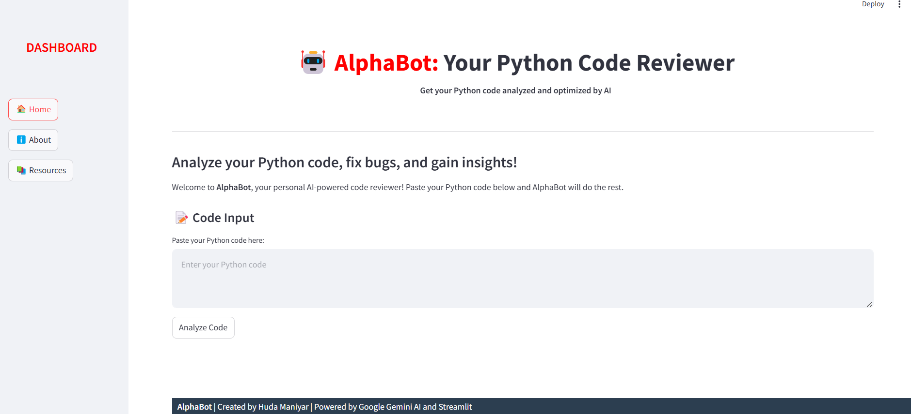
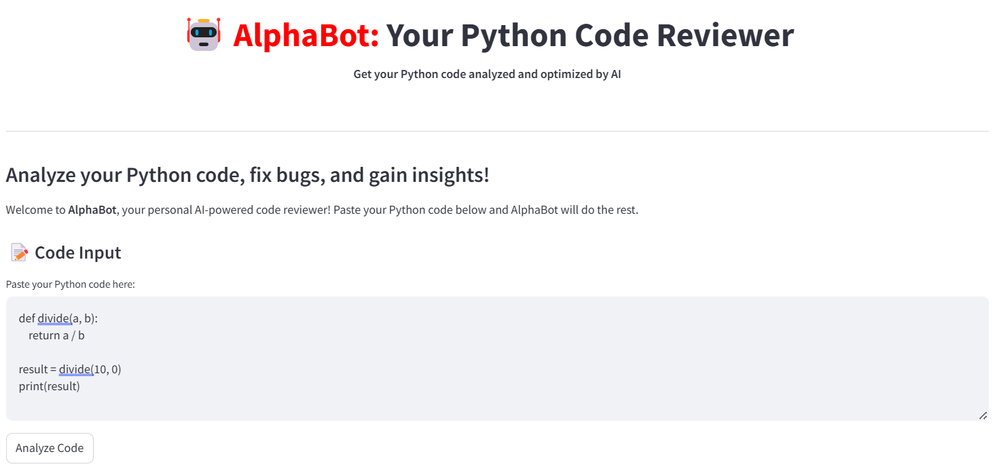
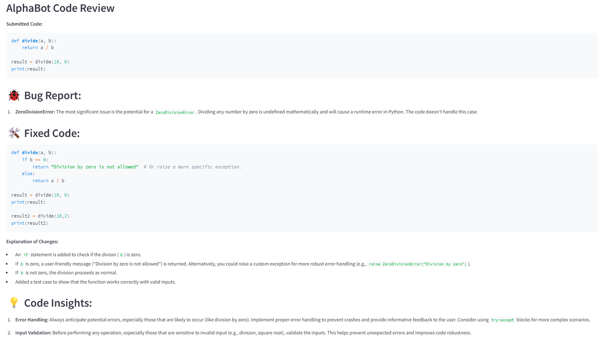

# PYTHON: AlphaBot - Python Code Reviewer

## PROJECT OVERVIEW

AlphaBot aims to provide an intuitive platform for developers to review Python code for potential bugs, logical errors, and areas of improvement. Users can submit their code through the application and receive comprehensive feedback, including a bug report, fixed code snippets, and insightful suggestions to enhance their coding practices.

<br />


****

<br />

## KEY FEATURES
<br />

**1. User-Friendly Interface:**
  - Developed using Streamlit, the application offers a clean and interactive user interface.
  - Users can easily input Python code via a text area for analysis.


**2. Code Analysis Powered by AI:**
  - Integrated with Google Gemini AI (Generative AI) for accurate and efficient code review functionality.
  - Provides detailed feedback categorized into three sections:
    - 🐞 Bug Report: Highlights potential bugs and logical flaws.
    - 🛠️ Fixed Code: Suggests optimized or corrected code snippets.
    - 💡 Code Insights: Offers practical and concise coding tips for improvement.

**3. Seamless Navigation:**
  - Includes a sidebar-based navigation system allowing users to switch between Home, About, and Resources pages effortlessly.

**4. Customizable System Prompt:**
  - Configured to deliver developer-friendly feedback tailored for varied skill levels, ensuring clarity and actionable suggestions.

**5. Progress Feedback:**
  - Users see a dynamic progress bar during the analysis to enhance interactivity and usability.

**6. Additional Features:**
   - A dedicated Resources section provides links to Python, Streamlit, and AI documentation.
   - Feedback submission allows users to share thoughts for application improvement.

<br />

## TECHNICAL STACK
<br />

- :white_check_mark: **Frontend**: Built with Streamlit for interactive UI/UX.
- :white_check_mark: **Backend**: Integrated with Google Gemini AI API for natural language-driven code analysis.
- :white_check_mark: **Deployment**: Designed to run as a lightweight Python application on local or cloud-hosted environments.

<br />

## HOW TO USE?
<br />

**1. Access the App:**
 - Download and SetUp
 - Run the Application using `streamlit run app.py`

**2. Navigate Through the Dashboard:**
  - Use the sidebar to switch between sections like Home, About, and Resources.

**3. Submit Your Python Code for Review:**
  - Go to the Home section.
  - Paste your Python code into the provided text area.
  - Click the Analyze Code button to start the review process.

**4. View Feedback:**
  - Bug Report: Lists potential bugs, syntax errors, or logical flaws.
  - Fixed Code: Shows optimized or corrected code snippets.
  - Code Insights: Provides helpful suggestions to improve your code.

**5. Explore Resources (Optional):**
  - Visit the Resources page for links to Python, Streamlit, and AI documentation or tutorials.

<br />

## DEMONSTRATION
<br />

**Example Code: Logical Error (Division by Zero)**

```
def divide(a, b):
    return a / b

result = divide(10, 0)
print(result)
```

<br />


### INPUT
****

<br />


### OUTPUT
****

<br />


**[Demo Video](AlphaBot_AppDemo.mp4)**

---
<br />

Please check out the **[Full Code]()** for Further Explanation!<br />
\
Your Thoughts and Feedback are highly appreciated! :smile:<br />


     

